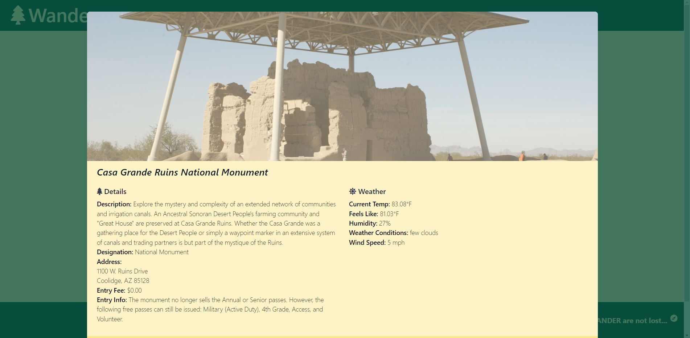

# Wander

## User Stories
```
As a NATURE LIKING INDIVIDUAL
I want to FIND NATIONAL PARKS IN A STATE
so that I CAN SEE WHAT OPTIONS ARE AVAILABLE TO ME
along with the WEATHER CONDITIONS AT SAID PARKS
and have an option to SAVE FAVORITE PARKS I wish to revisit.
```

## Website

The website address is https://gunther123.github.io/Wander/



## Functionality Overview

Using the [NPS.Gov](https://www.nps.gov/) API, The user may input a two character state code (Example: NY) and return a list of National Parks, Trails, and Historic Sites in that state. Then, using the OpenWeather API, Loop through the parks Lat&Long to return the weather conditions for that park using the OpenWeather API [Open Call API](https://openweathermap.org/api/one-call-api).  The user may also elect to save their favorite parks to local storage, with an option to recall them at a later time.

* NPS.gov API Token `KrGPbUdmA0msAP4qXYSGzKcU89oOOcHNzdJ7Gpek`
* OpenWeather API Token `bd344e93ec76626ec8f7447158241355`

## Example API Calls

* Nationa Parks in NY:
   ```https://developer.nps.gov/api/v1/parks?stateCode=NY&api_key=KrGPbUdmA0msAP4qXYSGzKcU89oOOcHNzdJ7Gpek```

## External Resources
* [NPS.gov API Docs](https://www.nps.gov/subjects/developer/api-documentation.htm)
* [OpenWeather API Docs](https://openweathermap.org/api)

## Credits
This project was made possible with hard work and dedication from the following individuals.
 - Adam Flynn ( https://github.com/adamjflynn )
 - Jesse Koon ( https://github.com/Jesse3421 )
 - Sandy McCabe ( https://github.com/SandyMcCabe )
 - Shawn McHenry ( https://github.com/drraccoony )
 - Steven Slocum ( https://github.com/gunther123 )

## Technologies 
Technologies used in the making of this site include HTML, CSS, Tailwinds, DOM Manipulation, JavaScript, JQuery, Modals and API Calls.

## License
This website is covered under the GNU General Public License v3.0 (GNU GPLv3).  For more details, see the attached documentation.  

./assets/License.txt
